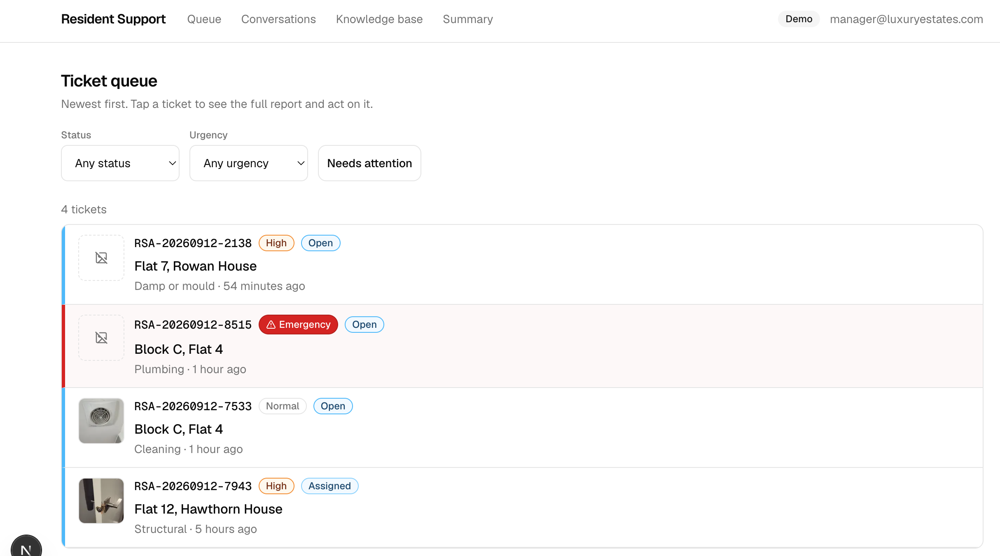
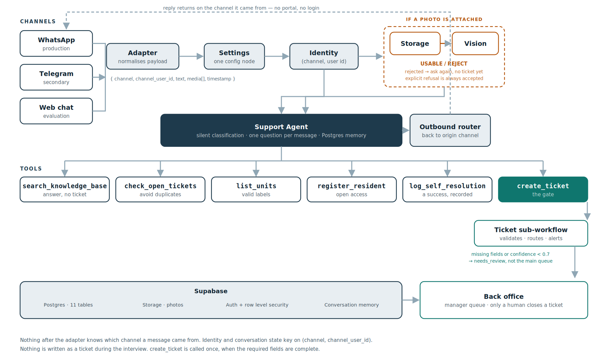

# Resident Support AI

## The problem

A resident's boiler breaks. They ring the estate office, wait on hold, and
explain it to whoever picks up. After five, or at the weekend, nobody picks up
and the report is lost.

What gets written down is rarely enough to act on. "Boiler not working, Flat 12"
tells a contractor nothing — no onset, no access window, no photo. So the
manager rings back. Sometimes twice. Days pass, almost none of it spent on the
repair.

## What this is

A complete intake system for estate repairs. Not a chatbot on a mailbox.

The resident messages on WhatsApp or Telegram. The agent identifies them and
their flat, answers routine questions outright, and for anything needing repair
runs the interview the manager would otherwise run — what, where, since when,
access, and a photo it verifies is usable. A structured, routed ticket lands in
the back office. The manager takes it from there.

Updates come back on the same thread. No portal, no login. The resident can
reply to dispute one, which reopens the ticket.

---

## Try it out

| WhatsApp | Telegram |
|:--:|:--:|
|  |  |
| [wa.me](https://wa.me/2349110574691?text=Hi) | [t.me](https://t.me/atlantizzz_bot) |

Say something is broken and answer what it asks.


- Manager's view (Back-Office): https://backoffice-resident-ai.vercel.app — opens straight into the queue, auto sign-in - demo




---

## Design rules

**Nothing becomes a ticket mid-interview.** Ticket creation is a tool the agent
calls once the required fields are complete. Abandoned conversations leave no
mess.

**Only a human closes a ticket.** Enforced by a database trigger, not a prompt.

**Questions answered are successes.** Bin days, parking permits, heating hours
resolve without a ticket and are logged as self-resolutions.

**Unknown senders are registered, not refused.** The flat number is a required
field, not a permission gate. Self-registered residents are flagged unverified.

**Photos must be usable.** Every image is checked against what was described.
Too dark, too far, or wrong subject is rejected and another asked for.

---

## Architecture



Each adapter normalises to one envelope: `{ channel, channel_user_id, text,
media[], timestamp }`. Nothing downstream knows the channel. Adding Telegram
took one adapter and one send node.

| Layer | Stack |
|---|---|
| Orchestration | n8n — core workflow + ticket sub-workflow |
| Agent | OpenAI, Postgres-backed conversation memory |
| Vision | GPT-4o, usable/reject verdict per photo |
| Data | Supabase — Postgres, storage, auth, RLS |
| Back office | Simple web ui for manager to miror Supabase |

---

## Reproduce it

**1. Database.** In the Supabase SQL editor, nothing highlighted, run in order:

```
db/schema.sql   --  tables, human-close trigger, register_resident()
db/seed.sql   --  estate, units, residents, 15 knowledge base entries
```

Run and create a public storage bucket named `ticket-photos` on supabase project.

**2. Workflows.** Import sub-workflow first:

```
workflows/Resident_Support_AI_-_Create_Ticket.json
workflows/Resident_Support_AI_-_Core.json
```

Attach credentials where flagged: Supabase, OpenAI, WhatsApp, Telegram,
Postgres (pooler, **port 6543**), SMTP. Set your values in the **Settings**
node — every environment value lives there. Activate both, then point the
WhatsApp webhook at the trigger's production URL.

**3. Back office.** add the .env variable from the env.example

**Verify:** message the bot, report a leaking tap, send a photo. A ticket
appears in the back office within seconds.

---

## Testing

Twelve labelled cases in `eval/test-cases.md`, plus six deliberate breaks.

```sql
select * from reset_all_test_data();               -- before a full run
select * from reset_tester('whatsapp','<number>'); -- between cases
```

Headline metric: **field completeness rate** — tickets carrying every field a
manager needs to act without asking anything further.

---

## Current state

Running: three channels, identity and self-registration, knowledge base
answers, full interview with photo verification, ticket creation with
confidence scoring and review queue, manager email alerts, retries on every
network call.

In progress: back office, manager-triggered status updates and the reopen
path, the twelve-case evaluation run.

## Known limits

- One estate. Multi-estate is a data change, not a feature.
- Self-registration is unverified. Production would check the resident roll.
  Deliberate: refusing unknown senders fails the person with the actual leak.
- No SLA tracking, vendor dispatch, or cost estimation. The system's job ends
  when a complete ticket reaches a human.
- Manager alerts are email only. Silent SMTP failure means no alert.
- Telegram's typing indicator lasts 5 seconds; a slow reply outlasts it.

## Repo

```
workflows/    n8n exports
db/           schema, seed, RLS
back-office/  manager interface
eval/         test cases, reset helpers, results
docs/         discovery, architecture, runbook, case study
```